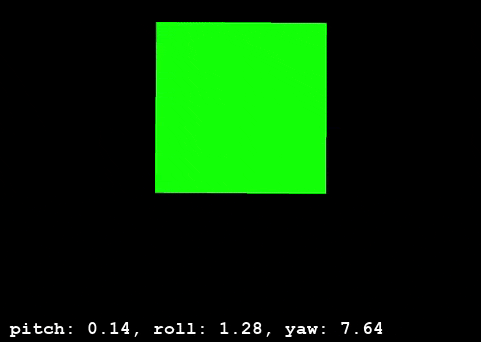

# Complementary-Filter
> Complementary filter for streamed IMU data from smart phone.

# Phone Data Acquisition Application
> https://play.google.com/store/apps/details?id=org.zwiener.wimu&hl=en_US&gl=US

## Dependencies
- Python 3.8.5
  - numpy
  - socket
  - pyopengl
  - pygame
  

## Usage
To run this program, change the hostIP to that of your local IPv4 address.

## Results
# No Filter

# Complementary Filter

## License
MIT 2020
